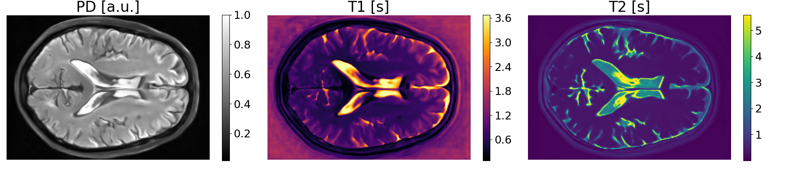
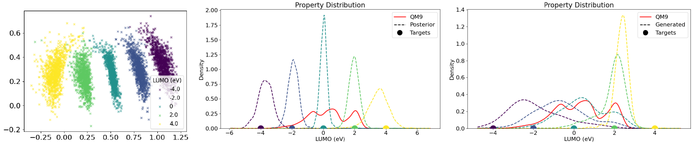
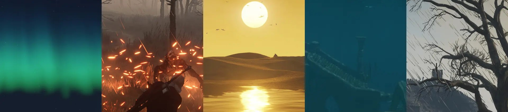

## About Me
Under construction...

## Work Experience

**10/2023 - now:** Machine Learning Engineer Working Student at [Delicious Data](https://www.delicious-data.com/) 
**04/2023 - 10/2023** Graphics Software Engineer Working Student at [Infineon Technologies](https://www.infineon.com/) 
**10/2021 - 09/2022** Research Assistant at the [Chair of Computer Graphics and Visualization at Technical University of Munich](https://www.cs.cit.tum.de/en/cg/cover-page/) 
**01/2020 - 09/2021** Software Development Working Student at [Rubinstein & Schmiedel](https://www.linkedin.com/company/rubinstein-schmiedel/) 
**04/2019 - 09/2019** Tutor for the [Practical Course: Real-time Computer Graphics at Technical University of Munich](https://campus.tum.de/tumonline/WBMODHB.wbShowMHBReadOnly?pKnotenNr=1517639)

## Education
**04/2022 - 03/2025** Master's Studies in Informatics at [Technical University of Munich](https://www.tum.de/) 
**04/2021 - 03/2022** Master's Studies in Informatics: Games Engineering at [Technical University of Munich](https://www.tum.de/) 
**10/2017 - 03/2021** Bachelors's Studies in Informatics: Games Engineering at [Technical University of Munich](https://www.tum.de/)

## Selected Projects
#### Physics-Informed Latent Diffusion for Multimodal Brain MRI Synthesis (2024) | [Project Page](https://sven-luepke.github.io/phy-ldm-mri/) | [Code](https://github.com/sven-luepke/phy-ldm-mri/)

- [Paper](https://arxiv.org/abs/2409.13532) presented at the [5th International Workshop on Multiscale Multimodal Medical Imaging](https://mmmi2024.github.io/) at [MICCAI 2024](https://conferences.miccai.org/2024/en/)
- Guided research project at the [Chair for Computer Aided Medical Procedures at Technical University of Munich](https://www.cs.cit.tum.de/camp/start/)

#### Generative Modeling for Inverse Molecular Design (2024) | [Code](https://github.com/sven-luepke/molecular-generative-modeling)

- Interdisciplinary project at the [Chair for Data-driven Materials Modeling](https://www.epc.ed.tum.de/ddmm/home/)

#### BlitzFX (2023) | [Code](https://github.com/sven-luepke/blitz-fx)

- Graphics effect injector for The Witcher 3 released on [Nexus Mods](https://www.nexusmods.com/witcher3/mods/6447)